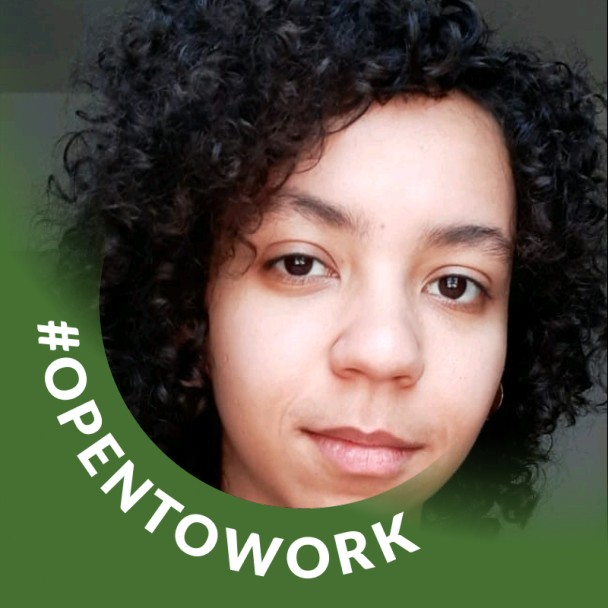

<h1 align="center">REDE SOCIAL - API REST</h1>

Em desenvolvimento 🛠 

  <a href="#Sobre">Sobre</a> •
  <a href="#Funcionalidades">Funcionalidades</a> •
  <a href="#Executar">Como Executar</a> •
  <a href="#Tecnologias">Tecnologias</a> •
  <a href="#Integrantes">Integrantes</a> •
  <a href="#Licenca">Licença</a>

<h2 id="Sobre">:computer: Sobre o projeto</h2>

  REDE SOCIAL - API REST: Uma plataforma que permite com que as pessoas publiquem, financiem e ajudem projetos voltados ao nosso querido planeta Terra com base na ODS 15 da ONU - Vida Terrestre.

  Esse projeto foi acompanhado pelos instrutores <a href="https://www.linkedin.com/in/lucas-capelotto-da-silva-43b26216a/">Lucas Capelotto da Silva</a> e <a href="https://www.linkedin.com/in/geandro-ara%C3%BAjo-1b19881b4/">Geandro Araújo</a> para que os alunos pudessem colocar em práticar os conhecimentos do módulo 2, de backend, no Projeto Integrador do grupo 4 da turma 19 da <a href="https://brazil.generation.org/">Generation Brasil</a>. 

<h2 id="Funcionalidades">⚙️ Funcionalidades</h2>

<h2 id="Executar">🚀 Como executar o projeto</h2>

<h2 id="Tecnologias">🛠 Tecnologias</h2>

Utilitários:

<h2 id="Integrantes">👨‍💻 Integrantes do Grupo</h2>

Esse projeto foi feito com muito ❤️ e carinho por essa galera, entre em contato :D

<table>
  <tr>
    <td>
        
      <a href="https://www.linkedin.com/in/anderson-correia/">
Anderson Correia
</a>
    </td>
    <td>
      
      <a href="https://www.linkedin.com/in/caiovitorfdev/">
Caio Vitor
</a>
    </td> 
    <td>
      
      <a href="https://www.linkedin.com/in/valisopmacamilla/">
Camilla Campos
</a>
    </td>
    <td>
      
      <a href="https://www.linkedin.com/in/tamires-alves-dos-santos-8893591a9/">
Tamires Alves
</a>
    </td>
  </tr>
</table>

<h2 id="Licenca">📝 Licença</h2>

Este projeto esta sobe a licença <a href="https://github.com/caio199307/Projeto_IntegradorG4/blob/99505619b567ba9cb970a3a5cf8fd8974d657599/LICENSE">MIT</a>.

